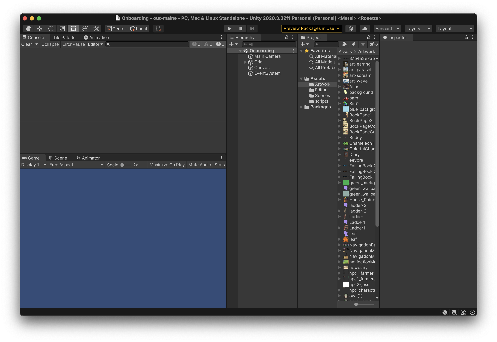

# Onboarding

Welcome to onboarding! Here you'll learn how to create a new branch in Github, create a new scene, and then publish the scene to Github. Those who want to focus more on the game design side will learn how to create and import their own assets. While those who care more about game development will learn how to add basic functionality to the sprites in the scene. Overachievers will learn how to do both!

_We'll be doing the same onboarding during our early meetings this semester. This is for those who joined late, missed a meeting, or want to go ahead._

### Switching Branches

Before we begin onboarding, we need to switch branches. To use a nerd analagy, think of branches as separate time lines. Each branch comes from a common origin(usually main), but diverges from one another. This allows programmers to each implement changes without at the same time without the risk of ruining each other's code.   

I've created a new branch specifically for onboarding that has a blank version of our games for learning. Let's get there.

1. Open the repository in Github Desktop. If you just did the setup, you should already be there.
2. At the top of the window there should be three boxes of text all in a line: "Current Repository," "Current Branch," and "Fetch Origin". Click on "Current Branch."
3. Select the "Onboarding" branch. If it doesn't show up, search for it in the search bar. 

_If upon switch branches, you receive a popup for resolving changes select "Leave changes on main."_

_If you get an "Overwrite Stash" prompt select "overwrite"_

### Creating a New Branch

Yay! You just switched branches!!!! But wait... The onboarding branch is a template that everyone needs to use, so it needs to stay the same. You need to create a new branch to create your scene in.

1. Select the "Current Branch" drop down again.
2. Click "New Branch" to the right of the search bar.
3. Name the branch "onboarding-name" where name is your name.
4. Under "Create branch based on..." make sure "onboarding" is highlieghted and not "main."

If all goes well, it should say the name of your branch under "Current Branch."

### Unity Editor Walkthrough

Now, let's create a scene! Actually before that, let does some learning

1. Open up the out maine project in Unity Hub

    _Hopefully, your screen looks like this. If not, the extra windows can be added by going to Window>General dropdown at the top of the Unity window._

2.  Before we go any further, let's do some explaining! 
    - In the top middle there is a play/pause button. Clicking play will run the game from the given scene. Clicking it again will stop it. You can tell when the game is active when the play button is highlighted.

         _Note: Changes made while the game is active **DO NOT SAVE**!_

    - The bottom left of your window is a preview of the scene.
    - Above that is the console, this will spit out any errors. Most of them can be ingored. 
    - To the right this is the heirarchy window. This shows all the game objects(i.e elements) in the scene. The order they appear determines, their order in the scene. The game objects at the bottom will be the bottom layer while the top most will be the highest layer. Let's break down these game objects already there:
        - EventSystem - Caputures keyboard inputs
        - Canvas - UI Layer. Elements that you want to always exist on screen go here(think minecraft inventory).
        - Grid - It  contains a Background object. This is what you should use to build your background.
        - Main Camera - The "thing" that actually sees and records the scene.  

        All sprites(playable or interactable objects) should go between the Grid and Main Camera game objects.
        
        - To the right of this is the Project tab. This just contains the project file strucutre. It's pretty self explanatory. Everything goes in assets under the correct folder. Scenes in scenes, artwork in artwork, etc. etc.
        - Lastly is the inspector. When you click on a game object, this is how you view and edit its properties.

    
###  Creating a Scene

For this exercise, you will be making a basic background and adding two sprite using existing artwork.

1. Click on the "Tile Map" tab next to "Console." This is where you store artwork to be used in the background/tile map.

2. Click the drop down that says "Create New Palette." Name it onboarding, store it in the assets folder for now. These will be stored in the prefab folder(which doesn't exist in this branch). We have one for every scene.

3. Start dragging art from the artwork folder into the empty tilemap. Each file you drag will ask you to make a tile. These are what unity uses to create the background.

4. When you have enough tiles, use the paint with active brush tool (B) to add them to the scene. Click on the "scene" tab next to "game" at the top of the bottom left window. Drag your mouse over the art element you want to add in the tile map. Then click to add it to the scene. Make sure you have the "background game object selected. To see what the scene looks like. Switch back to the "game" tab or click on the "Main Camera" Object.

_This step is super finicky. It just takes some practice to get used to._

5. To create a sprite. Go to the "Game Object," click "Create Empty." Name it whatever, make sure it's between Main Camera and Grid in the heirarchy window. Then in the Inpsector click "add component." Look up "Sprite Renderer." Under the "sprite" option, click the circle with a dot in it and select an artwork to be the sprite.
6. Do this again to make a second sprite.

### Adding Movement

A lot of this functionality has been built out, so you're just adding things.

1. Open up your sprite in the Inspector.
2. You're going to add three components.

    - A script called "player"
    - A Rigidbody 2D
        - Set gravity to 0
    - A Box Collider 2D

3. Now, run the game. You should be able to use WASD to move around.

For now, your done! Congrats on making a scene!!!

### Commiting and Pushing Changes

Before you finish you need to save your changed to github.

1. Go back to GitHub Desktop.

2. At the bottom left, there's a text box that says "summary(required)." This is a commit message. This goes alongside your files that are uploaded to Github. This is how developers keep track of what changes have been made. It's important to leave a quick helpful message such as "Finished onboarding scene" or "added background". Write a quick message and click commit.

3. Click the box next to "Current Branch." For new branches it will say "Publish this branch," while for old ones it will say "Push origin".

That's it! Congrats. You just learned how to use Github and how to navigate Unity. There's still some left to learn, but it's all down hill from here.

